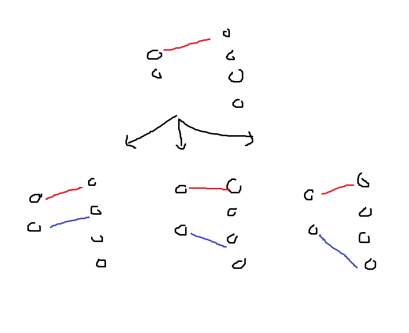

# 1010번: 다리 놓기

## 문제 내용:
왼쪽 영역 N개, 오른쪽 영역 M개가 주어지고, 교차하지 않고 이들을 N개의 다리로 이을 수 있는 경우의 수 구하기.

## 나의 접근 방식:
### 1. 재귀

```C++
int leg(int pos, int cnt, int maxN, int maxM){
    if(cnt >= maxN){
        return 1;
    }
    if(pos >= maxM){
        return 0;
    }
    
    return leg(pos+1, cnt, maxN, maxM) + leg(pos+1, cnt+1, maxN, maxM);
}
```

N개의 영역을 하나씩 선택해서 경우를 일일이 재귀로 구하는 방법!   
문제는 N=15, M=30과 같은 입력이 들어오면 (N=0인 경우)*(N=1인 경우 + ... N=15인 경우) (이때 N=k인 경우에 대하여 또 곱하기를 해줌. 즉, 자식이 k-1개인 트리다.)



그러나.. 시간 초과 발생!!   
따라서 반복 수행되는 것을 배열에 미리 저장하는 메모이제이션 방식으로 구현하기로 함.


### 2. 메모이제이션(하향식)

```C++
int memo[31][31];

int leg(int n, int m){
    if(n==m){
        return 1;
    }else if(n==1){
        return m;
    }
    
    if(memo[n][m]){
        return memo[n][m];
    }
    
    memo[n][m] = 0;
    int mIndex = m;
    while(true){
        mIndex--;
        memo[n][m] += leg(n-1, mIndex);
        if(n>mIndex){
            break;
        }
    }
    
    return memo[n][m];
}
```

2차원 배열에 n과 m에 대해 기록해두고, 있으면 그 값을 return하도록 코드를 짬.

아이디어는 다음과 같다:   
주어진 n<=m에 대하여, 1개의 영역을 잇고 나머지 영역은 다시 leg(n-1, m-1)을 구하는 것과 같음.   
그리고 다리는 교차를 못하기때문에 만약 k개의 영역을 건너고 영역을 잇는다면, 그 만큼 영역은 제외된다.   
따라서 leg(n-1, m-k)를 계산하는 것과 같음.   
이러한 논리로, for문을 통해 mIndex를 1씩 빼주고, 그런 모든 mIndex에 대해 leg(n-1, mIndex)를 다시 재귀로 구해주면   
위에서부터 하나씩 영역을 이엇을 때의 모든 경우의 수를 구할 수 있다!   
그리고 최종적으로 이를 m[n][m]에 담아서 return해줌.

백준 실행결과 성공!


## 문제 후기

걸린 시간 : 1시간   
감상평 : 간단한 dp문제이다. chatgpt한테 물어보니 조합으로 그냥 풀 수 있는거랜다.. dp문제에 익숙해져야겠다.
